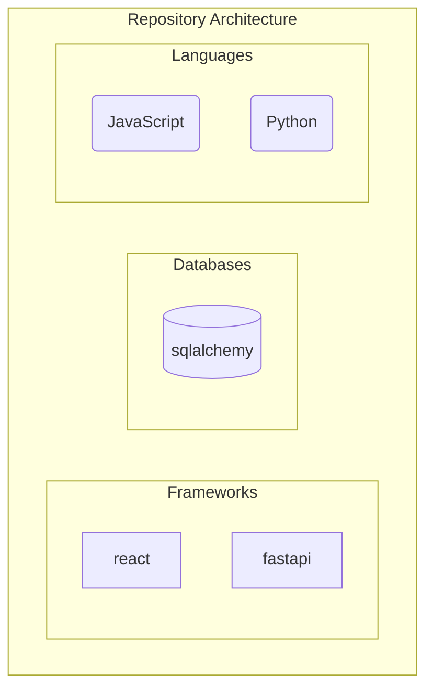

# INFOSYS-SPRINGBOARD


## Overview
This repository is fully autonomous and self-documenting. Documentation, architecture diagrams, and knowledge graphs are automatically generated and updated via CI/CD pipelines whenever code changes occur.

## Technology Stack
### Languages
- JavaScript
- Python
### Frameworks & Libraries
- react
- fastapi
### Databases
- sqlalchemy

## Architecture
### Architecture Diagram


### Module Relationships

```mermaid
graph LR
    N0[main.py]
    N1[pytesseract]
    N0 --> N1
    N0[main.py]
    N2[PIL]
    N0 --> N2
    N0[main.py]
    N3[os]
    N0 --> N3
    N0[main.py]
    N4[google.generativeai]
    N0 --> N4
    N0[main.py]
    N5[dotenv]
    N0 --> N5
    N0[main.py]
    N6[pathlib]
    N0 --> N6
    N7[verify_auth_e2e.py]
    N8[requests]
    N7 --> N8
    N7[verify_auth_e2e.py]
    N9[json]
    N7 --> N9
    N7[verify_auth_e2e.py]
    N3[os]
    N7 --> N3
    N10[replace_currency.py]
    N3[os]
    N10 --> N3
    N10[replace_currency.py]
    N11[re]
    N10 --> N11
    N12[test_llm_direct.py]
    N13[asyncio]
    N12 --> N13
    N12[test_llm_direct.py]
    N14[app.services.llm_service]
    N12 --> N14
    N12[test_llm_direct.py]
    N15[traceback]
    N12 --> N15
    N16[verify_backend_e2e.py]
    N3[os]
    N16 --> N3
    N16[verify_backend_e2e.py]
    N17[sys]
    N16 --> N17
    N16[verify_backend_e2e.py]
    N13[asyncio]
    N16 --> N13
    N16[verify_backend_e2e.py]
    N9[json]
    N16 --> N9
    N16[verify_backend_e2e.py]
    N18[fitz]
    N16 --> N18
    N16[verify_backend_e2e.py]
    N19[app.services.ocr_service]
    N16 --> N19
    N16[verify_backend_e2e.py]
    N14[app.services.llm_service]
    N16 --> N14
    N16[verify_backend_e2e.py]
    N20[app.config]
    N16 --> N20
    N21[test_analyze.py]
    N22[urllib.request]
    N21 --> N22
    N21[test_analyze.py]
    N23[urllib.error]
    N21 --> N23
    N21[test_analyze.py]
    N9[json]
    N21 --> N9
    N24[test_llm.py]
    N13[asyncio]
    N24 --> N13
    N24[test_llm.py]
    N14[app.services.llm_service]
    N24 --> N14
    N25[verify_key.py]
    N3[os]
    N25 --> N3
    N25[verify_key.py]
    N4[google.generativeai]
    N25 --> N4
    N25[verify_key.py]
    N5[dotenv]
    N25 --> N5
    N26[migrate_db.py]
    N27[sqlite3]
    N26 --> N27
    N26[migrate_db.py]
    N3[os]
    N26 --> N3
    N28[env.py]
    N17[sys]
    N28 --> N17
    N28[env.py]
    N3[os]
    N28 --> N3
    N28[env.py]
    N29[logging.config]
    N28 --> N29
    N28[env.py]
    N30[sqlalchemy]
    N28 --> N30
    N28[env.py]
    N31[alembic]
    N28 --> N31
    N28[env.py]
    N20[app.config]
    N28 --> N20
    N28[env.py]
    N32[app.database]
    N28 --> N32
    N33[001_initial_schema.py]
    N34[typing]
    N33 --> N34
    N33[001_initial_schema.py]
    N31[alembic]
    N33 --> N31
    N33[001_initial_schema.py]
    N30[sqlalchemy]
    N33 --> N30
    N35[test_pricing.py]
    N36[pytest]
    N35 --> N36
    N35[test_pricing.py]
    N13[asyncio]
    N35 --> N13
    N35[test_pricing.py]
    N37[unittest.mock]
    N35 --> N37
    N35[test_pricing.py]
    N38[app.services.pricing_adapters]
    N35 --> N38
    N35[test_pricing.py]
    N39[app.services.price_service]
    N35 --> N39
    N40[test_audit.py]
    N17[sys]
    N40 --> N17
    N40[test_audit.py]
    N3[os]
    N40 --> N3
    N40[test_audit.py]
    N41[unittest]
    N40 --> N41
    N40[test_audit.py]
    N42[datetime]
    N40 --> N42
    %% Graph truncated for readability
    click N0 href "./Gemini_File_QA/main.py" "View source file"
    click N7 href "./CarContractApp/verify_auth_e2e.py" "View source file"
    click N10 href "./CarContractApp/flutter_app/replace_currency.py" "View source file"
    click N12 href "./CarContractApp/backend/test_llm_direct.py" "View source file"
    click N16 href "./CarContractApp/backend/verify_backend_e2e.py" "View source file"
    click N21 href "./CarContractApp/backend/test_analyze.py" "View source file"
    click N24 href "./CarContractApp/backend/test_llm.py" "View source file"
    click N25 href "./CarContractApp/backend/verify_key.py" "View source file"
    click N26 href "./CarContractApp/backend/migrate_db.py" "View source file"
    click N28 href "./CarContractApp/backend/alembic/env.py" "View source file"
    click N33 href "./CarContractApp/backend/alembic/versions/001_initial_schema.py" "View source file"
    click N35 href "./CarContractApp/backend/tests/test_pricing.py" "View source file"
    click N40 href "./CarContractApp/backend/tests/test_audit.py" "View source file"
```


## Repository Structure
```text
├── README.md
├── Gap Analysis
├── repo_knowledge_graph.json
├── OnePageContract_page-0001.jpg
├── module_relationships.md
├── CHANGELOG.md
├── main.py
├── .gitignore
├── architecture_diagram.md
├── Gemini_File_QA/
│   ├── run_app.bat
│   ├── requirements.txt
│   ├── sample.txt
│   └── main.py
└── CarContractApp/
    ├── README.md
    ├── verify_auth_e2e.py
    ├── contract_app.db
    ├── start_backend.bat
    ├── start_flutter.bat
    ├── docker-compose.yml
    ├── start_app.bat
    ├── flutter_app/
    │   ├── README.md
    │   ├── pubspec.yaml
    │   ├── pubspec.lock
    │   ├── analysis_options.yaml
    │   ├── .metadata
    │   ├── .gitignore
    │   ├── replace_currency.py
... (truncated for brevity)
```

## Setup & Installation
*(Auto-generated based on detected technologies)*
### Python Setup
```bash
python -m venv venv
source venv/bin/activate  # On Windows use `venv\Scripts\activate`
```
### Node.js Setup
```bash
```

## Contribution Guide
1. Fork the repository.
2. Create a feature branch.
3. Commit your changes. (The CI/CD pipeline will automatically update documentation and diagrams)
4. Submit a Pull Request.