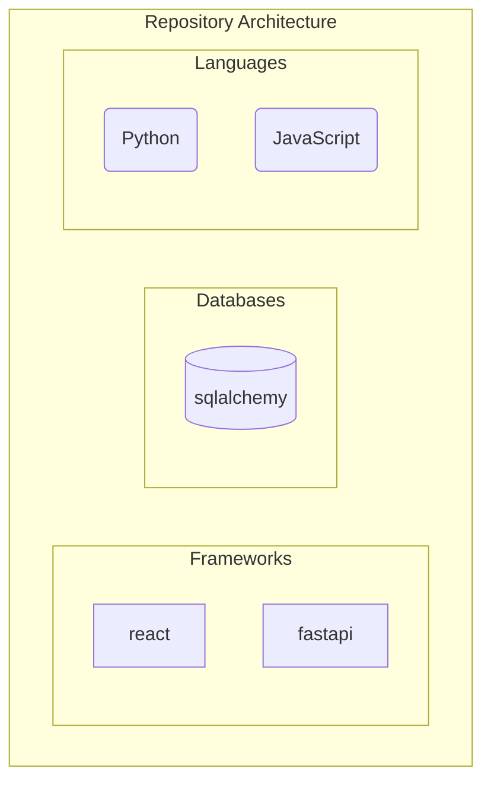

# INFOSYS-SPRINGBOARD


## Overview
This repository is fully autonomous and self-documenting. Documentation, architecture diagrams, and knowledge graphs are automatically generated and updated via CI/CD pipelines whenever code changes occur.

## Technology Stack
### Languages
- Python
- JavaScript
### Frameworks & Libraries
- react
- fastapi
### Databases
- sqlalchemy

## Architecture
### Architecture Diagram


### Module Relationships

```mermaid
graph LR
    N0[main.py]
    N1[pytesseract]
    N0 --> N1
    N0[main.py]
    N2[PIL]
    N0 --> N2
    N0[main.py]
    N3[os]
    N0 --> N3
    N0[main.py]
    N4[google.generativeai]
    N0 --> N4
    N0[main.py]
    N5[dotenv]
    N0 --> N5
    N0[main.py]
    N6[pathlib]
    N0 --> N6
    N7[verify_auth_e2e.py]
    N8[requests]
    N7 --> N8
    N7[verify_auth_e2e.py]
    N9[json]
    N7 --> N9
    N7[verify_auth_e2e.py]
    N3[os]
    N7 --> N3
    N10[replace_currency.py]
    N3[os]
    N10 --> N3
    N10[replace_currency.py]
    N11[re]
    N10 --> N11
    N12[migrate_db.py]
    N13[sqlite3]
    N12 --> N13
    N12[migrate_db.py]
    N3[os]
    N12 --> N3
    N14[verify_backend_e2e.py]
    N3[os]
    N14 --> N3
    N14[verify_backend_e2e.py]
    N15[sys]
    N14 --> N15
    N14[verify_backend_e2e.py]
    N16[asyncio]
    N14 --> N16
    N14[verify_backend_e2e.py]
    N9[json]
    N14 --> N9
    N14[verify_backend_e2e.py]
    N17[fitz]
    N14 --> N17
    N14[verify_backend_e2e.py]
    N18[app.services.ocr_service]
    N14 --> N18
    N14[verify_backend_e2e.py]
    N19[app.services.llm_service]
    N14 --> N19
    N14[verify_backend_e2e.py]
    N20[app.config]
    N14 --> N20
    N21[test_llm.py]
    N16[asyncio]
    N21 --> N16
    N21[test_llm.py]
    N19[app.services.llm_service]
    N21 --> N19
    N22[test_llm_direct.py]
    N16[asyncio]
    N22 --> N16
    N22[test_llm_direct.py]
    N19[app.services.llm_service]
    N22 --> N19
    N22[test_llm_direct.py]
    N23[traceback]
    N22 --> N23
    N24[test_analyze.py]
    N25[urllib.request]
    N24 --> N25
    N24[test_analyze.py]
    N26[urllib.error]
    N24 --> N26
    N24[test_analyze.py]
    N9[json]
    N24 --> N9
    N27[verify_key.py]
    N3[os]
    N27 --> N3
    N27[verify_key.py]
    N4[google.generativeai]
    N27 --> N4
    N27[verify_key.py]
    N5[dotenv]
    N27 --> N5
    N28[env.py]
    N15[sys]
    N28 --> N15
    N28[env.py]
    N3[os]
    N28 --> N3
    N28[env.py]
    N29[logging.config]
    N28 --> N29
    N28[env.py]
    N30[sqlalchemy]
    N28 --> N30
    N28[env.py]
    N31[alembic]
    N28 --> N31
    N28[env.py]
    N20[app.config]
    N28 --> N20
    N28[env.py]
    N32[app.database]
    N28 --> N32
    N33[001_initial_schema.py]
    N34[typing]
    N33 --> N34
    N33[001_initial_schema.py]
    N31[alembic]
    N33 --> N31
    N33[001_initial_schema.py]
    N30[sqlalchemy]
    N33 --> N30
    N35[test_scoring.py]
    N15[sys]
    N35 --> N15
    N35[test_scoring.py]
    N3[os]
    N35 --> N3
    N35[test_scoring.py]
    N36[unittest]
    N35 --> N36
    N35[test_scoring.py]
    N37[app.services.scoring_engine]
    N35 --> N37
    N35[test_scoring.py]
    N38[app.models.schemas]
    N35 --> N38
    N39[test_audit.py]
    N15[sys]
    N39 --> N15
    N39[test_audit.py]
    N3[os]
    N39 --> N3
    N39[test_audit.py]
    N36[unittest]
    N39 --> N36
    N39[test_audit.py]
    N40[datetime]
    N39 --> N40
    %% Graph truncated for readability
    click N0 href "./Gemini_File_QA/main.py" "View source file"
    click N7 href "./CarContractApp/verify_auth_e2e.py" "View source file"
    click N10 href "./CarContractApp/flutter_app/replace_currency.py" "View source file"
    click N12 href "./CarContractApp/backend/migrate_db.py" "View source file"
    click N14 href "./CarContractApp/backend/verify_backend_e2e.py" "View source file"
    click N21 href "./CarContractApp/backend/test_llm.py" "View source file"
    click N22 href "./CarContractApp/backend/test_llm_direct.py" "View source file"
    click N24 href "./CarContractApp/backend/test_analyze.py" "View source file"
    click N27 href "./CarContractApp/backend/verify_key.py" "View source file"
    click N28 href "./CarContractApp/backend/alembic/env.py" "View source file"
    click N33 href "./CarContractApp/backend/alembic/versions/001_initial_schema.py" "View source file"
    click N35 href "./CarContractApp/backend/tests/test_scoring.py" "View source file"
    click N39 href "./CarContractApp/backend/tests/test_audit.py" "View source file"
```


## Repository Structure
```text
├── main.py
├── CHANGELOG.md
├── repo_knowledge_graph.json
├── architecture_diagram.md
├── Gap Analysis
├── module_relationships.md
├── README.md
├── .gitignore
├── OnePageContract_page-0001.jpg
├── Gemini_File_QA/
│   ├── requirements.txt
│   ├── main.py
│   ├── run_app.bat
│   └── sample.txt
└── CarContractApp/
    ├── verify_auth_e2e.py
    ├── docker-compose.yml
    ├── start_backend.bat
    ├── start_app.bat
    ├── contract_app.db
    ├── README.md
    ├── start_flutter.bat
    ├── frontend/
    │   ├── package-lock.json
    │   ├── index.html
    │   ├── package.json
    │   ├── vite.config.js
    │   └── src/
    │       ├── App.jsx
    │       ├── main.jsx
... (truncated for brevity)
```

## Setup & Installation
*(Auto-generated based on detected technologies)*
### Python Setup
```bash
python -m venv venv
source venv/bin/activate  # On Windows use `venv\Scripts\activate`
```
### Node.js Setup
```bash
```

## Contribution Guide
1. Fork the repository.
2. Create a feature branch.
3. Commit your changes. (The CI/CD pipeline will automatically update documentation and diagrams)
4. Submit a Pull Request.