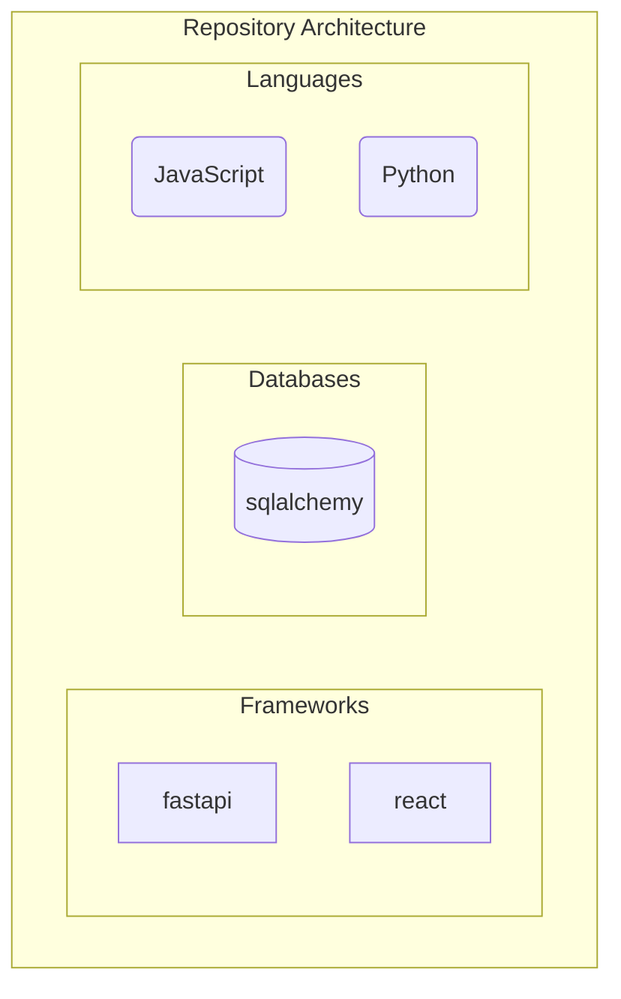

# INFOSYS-SPRINGBOARD


## Overview
This repository is fully autonomous and self-documenting. Documentation, architecture diagrams, and knowledge graphs are automatically generated and updated via CI/CD pipelines whenever code changes occur.

## Technology Stack
### Languages
- JavaScript
- Python
### Frameworks & Libraries
- fastapi
- react
### Databases
- sqlalchemy

## Architecture
### Architecture Diagram


### Module Relationships

```mermaid
graph LR
    N0[main.py]
    N1[pytesseract]
    N0 --> N1
    N0[main.py]
    N2[PIL]
    N0 --> N2
    N0[main.py]
    N3[os]
    N0 --> N3
    N4[verify_auth_e2e.py]
    N5[requests]
    N4 --> N5
    N4[verify_auth_e2e.py]
    N6[json]
    N4 --> N6
    N4[verify_auth_e2e.py]
    N3[os]
    N4 --> N3
    N7[test_llm.py]
    N8[asyncio]
    N7 --> N8
    N7[test_llm.py]
    N9[app.services.llm_service]
    N7 --> N9
    N10[test_analyze.py]
    N11[urllib.request]
    N10 --> N11
    N10[test_analyze.py]
    N12[urllib.error]
    N10 --> N12
    N10[test_analyze.py]
    N6[json]
    N10 --> N6
    N13[test_llm_direct.py]
    N8[asyncio]
    N13 --> N8
    N13[test_llm_direct.py]
    N9[app.services.llm_service]
    N13 --> N9
    N13[test_llm_direct.py]
    N14[traceback]
    N13 --> N14
    N15[verify_key.py]
    N3[os]
    N15 --> N3
    N15[verify_key.py]
    N16[google.generativeai]
    N15 --> N16
    N15[verify_key.py]
    N17[dotenv]
    N15 --> N17
    N18[verify_backend_e2e.py]
    N3[os]
    N18 --> N3
    N18[verify_backend_e2e.py]
    N19[sys]
    N18 --> N19
    N18[verify_backend_e2e.py]
    N8[asyncio]
    N18 --> N8
    N18[verify_backend_e2e.py]
    N6[json]
    N18 --> N6
    N18[verify_backend_e2e.py]
    N20[fitz]
    N18 --> N20
    N18[verify_backend_e2e.py]
    N21[app.services.ocr_service]
    N18 --> N21
    N18[verify_backend_e2e.py]
    N9[app.services.llm_service]
    N18 --> N9
    N18[verify_backend_e2e.py]
    N22[app.config]
    N18 --> N22
    N23[migrate_db.py]
    N24[sqlite3]
    N23 --> N24
    N23[migrate_db.py]
    N3[os]
    N23 --> N3
    N25[env.py]
    N19[sys]
    N25 --> N19
    N25[env.py]
    N3[os]
    N25 --> N3
    N25[env.py]
    N26[logging.config]
    N25 --> N26
    N25[env.py]
    N27[sqlalchemy]
    N25 --> N27
    N25[env.py]
    N28[alembic]
    N25 --> N28
    N25[env.py]
    N22[app.config]
    N25 --> N22
    N25[env.py]
    N29[app.database]
    N25 --> N29
    N30[001_initial_schema.py]
    N31[typing]
    N30 --> N31
    N30[001_initial_schema.py]
    N28[alembic]
    N30 --> N28
    N30[001_initial_schema.py]
    N27[sqlalchemy]
    N30 --> N27
    N32[test_audit.py]
    N19[sys]
    N32 --> N19
    N32[test_audit.py]
    N3[os]
    N32 --> N3
    N32[test_audit.py]
    N33[unittest]
    N32 --> N33
    N32[test_audit.py]
    N34[datetime]
    N32 --> N34
    N32[test_audit.py]
    N27[sqlalchemy]
    N32 --> N27
    N32[test_audit.py]
    N35[sqlalchemy.orm]
    N32 --> N35
    N32[test_audit.py]
    N29[app.database]
    N32 --> N29
    N32[test_audit.py]
    N36[app.services.audit_service]
    N32 --> N36
    N37[test_scoring.py]
    N19[sys]
    N37 --> N19
    N37[test_scoring.py]
    N3[os]
    N37 --> N3
    N37[test_scoring.py]
    N33[unittest]
    N37 --> N33
    N37[test_scoring.py]
    N38[app.services.scoring_engine]
    N37 --> N38
    N37[test_scoring.py]
    N39[app.models.schemas]
    N37 --> N39
    N40[test_pricing.py]
    N41[pytest]
    N40 --> N41
    %% Graph truncated for readability
    click N0 href "./main.py" "View source file"
    click N4 href "./CarContractApp/verify_auth_e2e.py" "View source file"
    click N7 href "./CarContractApp/backend/test_llm.py" "View source file"
    click N10 href "./CarContractApp/backend/test_analyze.py" "View source file"
    click N13 href "./CarContractApp/backend/test_llm_direct.py" "View source file"
    click N15 href "./CarContractApp/backend/verify_key.py" "View source file"
    click N18 href "./CarContractApp/backend/verify_backend_e2e.py" "View source file"
    click N23 href "./CarContractApp/backend/migrate_db.py" "View source file"
    click N25 href "./CarContractApp/backend/alembic/env.py" "View source file"
    click N30 href "./CarContractApp/backend/alembic/versions/001_initial_schema.py" "View source file"
    click N32 href "./CarContractApp/backend/tests/test_audit.py" "View source file"
    click N37 href "./CarContractApp/backend/tests/test_scoring.py" "View source file"
    click N40 href "./CarContractApp/backend/tests/test_pricing.py" "View source file"
```


## Repository Structure
```text
├── OnePageContract_page-0001.jpg
├── module_relationships.md
├── CHANGELOG.md
├── main.py
├── Gap Analysis
├── .gitignore
├── architecture_diagram.md
├── README.md
├── repo_knowledge_graph.json
├── CarContractApp/
│   ├── start_backend.bat
│   ├── start_flutter.bat
│   ├── docker-compose.yml
│   ├── start_app.bat
│   ├── contract_app.db
│   ├── verify_auth_e2e.py
│   ├── README.md
│   ├── backend/
│   │   ├── test_llm.py
│   │   ├── alembic.ini
│   │   ├── .env.example
│   │   ├── test_analyze.py
│   │   ├── requirements.txt
│   │   ├── run_backend.bat
│   │   ├── test_llm_direct.py
│   │   ├── contract_app.db
│   │   ├── Dockerfile
│   │   ├── verify_key.py
│   │   ├── verify_backend_e2e.py
│   │   ├── migrate_db.py
... (truncated for brevity)
```

## Setup & Installation
*(Auto-generated based on detected technologies)*
### Python Setup
```bash
python -m venv venv
source venv/bin/activate  # On Windows use `venv\Scripts\activate`
```
### Node.js Setup
```bash
```

## Contribution Guide
1. Fork the repository.
2. Create a feature branch.
3. Commit your changes. (The CI/CD pipeline will automatically update documentation and diagrams)
4. Submit a Pull Request.