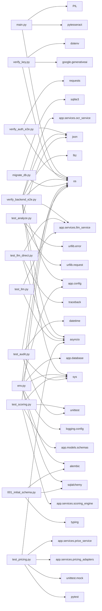

```mermaid
graph LR
    N0[main.py]
    N1[pytesseract]
    N0 --> N1
    N0[main.py]
    N2[PIL]
    N0 --> N2
    N0[main.py]
    N3[os]
    N0 --> N3
    N4[verify_auth_e2e.py]
    N5[requests]
    N4 --> N5
    N4[verify_auth_e2e.py]
    N6[json]
    N4 --> N6
    N4[verify_auth_e2e.py]
    N3[os]
    N4 --> N3
    N7[verify_key.py]
    N3[os]
    N7 --> N3
    N7[verify_key.py]
    N8[google.generativeai]
    N7 --> N8
    N7[verify_key.py]
    N9[dotenv]
    N7 --> N9
    N10[verify_backend_e2e.py]
    N3[os]
    N10 --> N3
    N10[verify_backend_e2e.py]
    N11[sys]
    N10 --> N11
    N10[verify_backend_e2e.py]
    N12[asyncio]
    N10 --> N12
    N10[verify_backend_e2e.py]
    N6[json]
    N10 --> N6
    N10[verify_backend_e2e.py]
    N13[fitz]
    N10 --> N13
    N10[verify_backend_e2e.py]
    N14[app.services.ocr_service]
    N10 --> N14
    N10[verify_backend_e2e.py]
    N15[app.services.llm_service]
    N10 --> N15
    N10[verify_backend_e2e.py]
    N16[app.config]
    N10 --> N16
    N17[test_llm_direct.py]
    N12[asyncio]
    N17 --> N12
    N17[test_llm_direct.py]
    N15[app.services.llm_service]
    N17 --> N15
    N17[test_llm_direct.py]
    N18[traceback]
    N17 --> N18
    N19[test_llm.py]
    N12[asyncio]
    N19 --> N12
    N19[test_llm.py]
    N15[app.services.llm_service]
    N19 --> N15
    N20[migrate_db.py]
    N21[sqlite3]
    N20 --> N21
    N20[migrate_db.py]
    N3[os]
    N20 --> N3
    N22[test_analyze.py]
    N23[urllib.request]
    N22 --> N23
    N22[test_analyze.py]
    N24[urllib.error]
    N22 --> N24
    N22[test_analyze.py]
    N6[json]
    N22 --> N6
    N25[env.py]
    N11[sys]
    N25 --> N11
    N25[env.py]
    N3[os]
    N25 --> N3
    N25[env.py]
    N26[logging.config]
    N25 --> N26
    N25[env.py]
    N27[sqlalchemy]
    N25 --> N27
    N25[env.py]
    N28[alembic]
    N25 --> N28
    N25[env.py]
    N16[app.config]
    N25 --> N16
    N25[env.py]
    N29[app.database]
    N25 --> N29
    N30[001_initial_schema.py]
    N31[typing]
    N30 --> N31
    N30[001_initial_schema.py]
    N28[alembic]
    N30 --> N28
    N30[001_initial_schema.py]
    N27[sqlalchemy]
    N30 --> N27
    N32[test_pricing.py]
    N33[pytest]
    N32 --> N33
    N32[test_pricing.py]
    N12[asyncio]
    N32 --> N12
    N32[test_pricing.py]
    N34[unittest.mock]
    N32 --> N34
    N32[test_pricing.py]
    N35[app.services.pricing_adapters]
    N32 --> N35
    N32[test_pricing.py]
    N36[app.services.price_service]
    N32 --> N36
    N37[test_scoring.py]
    N11[sys]
    N37 --> N11
    N37[test_scoring.py]
    N3[os]
    N37 --> N3
    N37[test_scoring.py]
    N38[unittest]
    N37 --> N38
    N37[test_scoring.py]
    N39[app.services.scoring_engine]
    N37 --> N39
    N37[test_scoring.py]
    N40[app.models.schemas]
    N37 --> N40
    N41[test_audit.py]
    N11[sys]
    N41 --> N11
    N41[test_audit.py]
    N3[os]
    N41 --> N3
    N41[test_audit.py]
    N38[unittest]
    N41 --> N38
    N41[test_audit.py]
    N42[datetime]
    N41 --> N42
    %% Graph truncated for readability
    click N0 href "./main.py" "View source file"
    click N4 href "./CarContractApp/verify_auth_e2e.py" "View source file"
    click N7 href "./CarContractApp/backend/verify_key.py" "View source file"
    click N10 href "./CarContractApp/backend/verify_backend_e2e.py" "View source file"
    click N17 href "./CarContractApp/backend/test_llm_direct.py" "View source file"
    click N19 href "./CarContractApp/backend/test_llm.py" "View source file"
    click N20 href "./CarContractApp/backend/migrate_db.py" "View source file"
    click N22 href "./CarContractApp/backend/test_analyze.py" "View source file"
    click N25 href "./CarContractApp/backend/alembic/env.py" "View source file"
    click N30 href "./CarContractApp/backend/alembic/versions/001_initial_schema.py" "View source file"
    click N32 href "./CarContractApp/backend/tests/test_pricing.py" "View source file"
    click N37 href "./CarContractApp/backend/tests/test_scoring.py" "View source file"
    click N41 href "./CarContractApp/backend/tests/test_audit.py" "View source file"
```