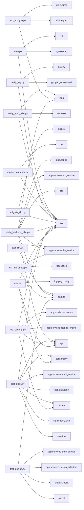

```mermaid
graph LR
    N0[main.py]
    N1[pytesseract]
    N0 --> N1
    N0[main.py]
    N2[PIL]
    N0 --> N2
    N0[main.py]
    N3[os]
    N0 --> N3
    N4[verify_auth_e2e.py]
    N5[requests]
    N4 --> N5
    N4[verify_auth_e2e.py]
    N6[json]
    N4 --> N6
    N4[verify_auth_e2e.py]
    N3[os]
    N4 --> N3
    N7[replace_currency.py]
    N3[os]
    N7 --> N3
    N7[replace_currency.py]
    N8[re]
    N7 --> N8
    N9[verify_key.py]
    N3[os]
    N9 --> N3
    N9[verify_key.py]
    N10[google.generativeai]
    N9 --> N10
    N9[verify_key.py]
    N11[dotenv]
    N9 --> N11
    N12[migrate_db.py]
    N13[sqlite3]
    N12 --> N13
    N12[migrate_db.py]
    N3[os]
    N12 --> N3
    N14[test_analyze.py]
    N15[urllib.request]
    N14 --> N15
    N14[test_analyze.py]
    N16[urllib.error]
    N14 --> N16
    N14[test_analyze.py]
    N6[json]
    N14 --> N6
    N17[test_llm.py]
    N18[asyncio]
    N17 --> N18
    N17[test_llm.py]
    N19[app.services.llm_service]
    N17 --> N19
    N20[verify_backend_e2e.py]
    N3[os]
    N20 --> N3
    N20[verify_backend_e2e.py]
    N21[sys]
    N20 --> N21
    N20[verify_backend_e2e.py]
    N18[asyncio]
    N20 --> N18
    N20[verify_backend_e2e.py]
    N6[json]
    N20 --> N6
    N20[verify_backend_e2e.py]
    N22[fitz]
    N20 --> N22
    N20[verify_backend_e2e.py]
    N23[app.services.ocr_service]
    N20 --> N23
    N20[verify_backend_e2e.py]
    N19[app.services.llm_service]
    N20 --> N19
    N20[verify_backend_e2e.py]
    N24[app.config]
    N20 --> N24
    N25[test_llm_direct.py]
    N18[asyncio]
    N25 --> N18
    N25[test_llm_direct.py]
    N19[app.services.llm_service]
    N25 --> N19
    N25[test_llm_direct.py]
    N26[traceback]
    N25 --> N26
    N27[test_audit.py]
    N21[sys]
    N27 --> N21
    N27[test_audit.py]
    N3[os]
    N27 --> N3
    N27[test_audit.py]
    N28[unittest]
    N27 --> N28
    N27[test_audit.py]
    N29[datetime]
    N27 --> N29
    N27[test_audit.py]
    N30[sqlalchemy]
    N27 --> N30
    N27[test_audit.py]
    N31[sqlalchemy.orm]
    N27 --> N31
    N27[test_audit.py]
    N32[app.database]
    N27 --> N32
    N27[test_audit.py]
    N33[app.services.audit_service]
    N27 --> N33
    N34[test_pricing.py]
    N35[pytest]
    N34 --> N35
    N34[test_pricing.py]
    N18[asyncio]
    N34 --> N18
    N34[test_pricing.py]
    N36[unittest.mock]
    N34 --> N36
    N34[test_pricing.py]
    N37[app.services.pricing_adapters]
    N34 --> N37
    N34[test_pricing.py]
    N38[app.services.price_service]
    N34 --> N38
    N39[test_scoring.py]
    N21[sys]
    N39 --> N21
    N39[test_scoring.py]
    N3[os]
    N39 --> N3
    N39[test_scoring.py]
    N28[unittest]
    N39 --> N28
    N39[test_scoring.py]
    N40[app.services.scoring_engine]
    N39 --> N40
    N39[test_scoring.py]
    N41[app.models.schemas]
    N39 --> N41
    N42[env.py]
    N21[sys]
    N42 --> N21
    N42[env.py]
    N3[os]
    N42 --> N3
    N42[env.py]
    N43[logging.config]
    N42 --> N43
    N42[env.py]
    N30[sqlalchemy]
    N42 --> N30
    %% Graph truncated for readability
    click N0 href "./main.py" "View source file"
    click N4 href "./CarContractApp/verify_auth_e2e.py" "View source file"
    click N7 href "./CarContractApp/flutter_app/replace_currency.py" "View source file"
    click N9 href "./CarContractApp/backend/verify_key.py" "View source file"
    click N12 href "./CarContractApp/backend/migrate_db.py" "View source file"
    click N14 href "./CarContractApp/backend/test_analyze.py" "View source file"
    click N17 href "./CarContractApp/backend/test_llm.py" "View source file"
    click N20 href "./CarContractApp/backend/verify_backend_e2e.py" "View source file"
    click N25 href "./CarContractApp/backend/test_llm_direct.py" "View source file"
    click N27 href "./CarContractApp/backend/tests/test_audit.py" "View source file"
    click N34 href "./CarContractApp/backend/tests/test_pricing.py" "View source file"
    click N39 href "./CarContractApp/backend/tests/test_scoring.py" "View source file"
    click N42 href "./CarContractApp/backend/alembic/env.py" "View source file"
```