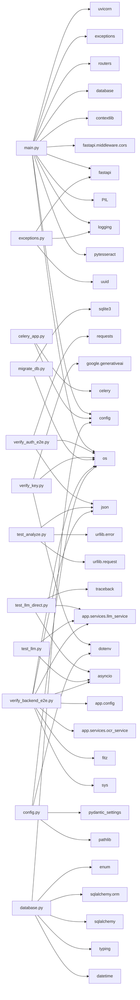

```mermaid
graph LR
    N0[main.py]
    N1[pytesseract]
    N0 --> N1
    N0[main.py]
    N2[PIL]
    N0 --> N2
    N0[main.py]
    N3[os]
    N0 --> N3
    N4[verify_auth_e2e.py]
    N5[requests]
    N4 --> N5
    N4[verify_auth_e2e.py]
    N6[json]
    N4 --> N6
    N4[verify_auth_e2e.py]
    N3[os]
    N4 --> N3
    N7[verify_key.py]
    N3[os]
    N7 --> N3
    N7[verify_key.py]
    N8[google.generativeai]
    N7 --> N8
    N7[verify_key.py]
    N9[dotenv]
    N7 --> N9
    N10[test_llm_direct.py]
    N11[asyncio]
    N10 --> N11
    N10[test_llm_direct.py]
    N12[app.services.llm_service]
    N10 --> N12
    N10[test_llm_direct.py]
    N13[traceback]
    N10 --> N13
    N14[test_analyze.py]
    N15[urllib.request]
    N14 --> N15
    N14[test_analyze.py]
    N16[urllib.error]
    N14 --> N16
    N14[test_analyze.py]
    N6[json]
    N14 --> N6
    N17[migrate_db.py]
    N18[sqlite3]
    N17 --> N18
    N17[migrate_db.py]
    N3[os]
    N17 --> N3
    N19[test_llm.py]
    N11[asyncio]
    N19 --> N11
    N19[test_llm.py]
    N12[app.services.llm_service]
    N19 --> N12
    N20[verify_backend_e2e.py]
    N3[os]
    N20 --> N3
    N20[verify_backend_e2e.py]
    N21[sys]
    N20 --> N21
    N20[verify_backend_e2e.py]
    N11[asyncio]
    N20 --> N11
    N20[verify_backend_e2e.py]
    N6[json]
    N20 --> N6
    N20[verify_backend_e2e.py]
    N22[fitz]
    N20 --> N22
    N20[verify_backend_e2e.py]
    N23[app.services.ocr_service]
    N20 --> N23
    N20[verify_backend_e2e.py]
    N12[app.services.llm_service]
    N20 --> N12
    N20[verify_backend_e2e.py]
    N24[app.config]
    N20 --> N24
    N0[main.py]
    N25[logging]
    N0 --> N25
    N0[main.py]
    N26[fastapi]
    N0 --> N26
    N0[main.py]
    N27[fastapi.middleware.cors]
    N0 --> N27
    N0[main.py]
    N28[contextlib]
    N0 --> N28
    N0[main.py]
    N29[config]
    N0 --> N29
    N0[main.py]
    N30[database]
    N0 --> N30
    N0[main.py]
    N31[routers]
    N0 --> N31
    N0[main.py]
    N32[exceptions]
    N0 --> N32
    N0[main.py]
    N33[uvicorn]
    N0 --> N33
    N34[celery_app.py]
    N35[celery]
    N34 --> N35
    N34[celery_app.py]
    N29[config]
    N34 --> N29
    N36[database.py]
    N37[datetime]
    N36 --> N37
    N36[database.py]
    N38[typing]
    N36 --> N38
    N36[database.py]
    N39[sqlalchemy]
    N36 --> N39
    N36[database.py]
    N40[sqlalchemy.orm]
    N36 --> N40
    N36[database.py]
    N29[config]
    N36 --> N29
    N36[database.py]
    N41[enum]
    N36 --> N41
    N42[config.py]
    N3[os]
    N42 --> N3
    N42[config.py]
    N43[pathlib]
    N42 --> N43
    N42[config.py]
    N9[dotenv]
    N42 --> N9
    N42[config.py]
    N44[pydantic_settings]
    N42 --> N44
    N45[exceptions.py]
    N46[uuid]
    N45 --> N46
    N45[exceptions.py]
    N25[logging]
    N45 --> N25
    N45[exceptions.py]
    N26[fastapi]
    N45 --> N26
    %% Graph truncated for readability
    click N0 href "./CarContractApp/backend/app/main.py" "View source file"
    click N4 href "./CarContractApp/verify_auth_e2e.py" "View source file"
    click N7 href "./CarContractApp/backend/verify_key.py" "View source file"
    click N10 href "./CarContractApp/backend/test_llm_direct.py" "View source file"
    click N14 href "./CarContractApp/backend/test_analyze.py" "View source file"
    click N17 href "./CarContractApp/backend/migrate_db.py" "View source file"
    click N19 href "./CarContractApp/backend/test_llm.py" "View source file"
    click N20 href "./CarContractApp/backend/verify_backend_e2e.py" "View source file"
    click N34 href "./CarContractApp/backend/app/celery_app.py" "View source file"
    click N36 href "./CarContractApp/backend/app/database.py" "View source file"
    click N42 href "./CarContractApp/backend/app/config.py" "View source file"
    click N45 href "./CarContractApp/backend/app/exceptions.py" "View source file"
```