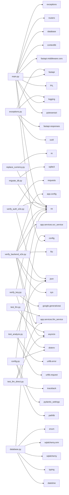

```mermaid
graph LR
    N0[main.py]
    N1[pytesseract]
    N0 --> N1
    N0[main.py]
    N2[PIL]
    N0 --> N2
    N0[main.py]
    N3[os]
    N0 --> N3
    N4[verify_auth_e2e.py]
    N5[requests]
    N4 --> N5
    N4[verify_auth_e2e.py]
    N6[json]
    N4 --> N6
    N4[verify_auth_e2e.py]
    N3[os]
    N4 --> N3
    N7[replace_currency.py]
    N3[os]
    N7 --> N3
    N7[replace_currency.py]
    N8[re]
    N7 --> N8
    N9[test_llm.py]
    N10[asyncio]
    N9 --> N10
    N9[test_llm.py]
    N11[app.services.llm_service]
    N9 --> N11
    N12[migrate_db.py]
    N13[sqlite3]
    N12 --> N13
    N12[migrate_db.py]
    N3[os]
    N12 --> N3
    N14[verify_backend_e2e.py]
    N3[os]
    N14 --> N3
    N14[verify_backend_e2e.py]
    N15[sys]
    N14 --> N15
    N14[verify_backend_e2e.py]
    N10[asyncio]
    N14 --> N10
    N14[verify_backend_e2e.py]
    N6[json]
    N14 --> N6
    N14[verify_backend_e2e.py]
    N16[fitz]
    N14 --> N16
    N14[verify_backend_e2e.py]
    N17[app.services.ocr_service]
    N14 --> N17
    N14[verify_backend_e2e.py]
    N11[app.services.llm_service]
    N14 --> N11
    N14[verify_backend_e2e.py]
    N18[app.config]
    N14 --> N18
    N19[test_analyze.py]
    N20[urllib.request]
    N19 --> N20
    N19[test_analyze.py]
    N21[urllib.error]
    N19 --> N21
    N19[test_analyze.py]
    N6[json]
    N19 --> N6
    N22[verify_key.py]
    N3[os]
    N22 --> N3
    N22[verify_key.py]
    N23[google.generativeai]
    N22 --> N23
    N22[verify_key.py]
    N24[dotenv]
    N22 --> N24
    N25[test_llm_direct.py]
    N10[asyncio]
    N25 --> N10
    N25[test_llm_direct.py]
    N11[app.services.llm_service]
    N25 --> N11
    N25[test_llm_direct.py]
    N26[traceback]
    N25 --> N26
    N27[exceptions.py]
    N28[uuid]
    N27 --> N28
    N27[exceptions.py]
    N29[logging]
    N27 --> N29
    N27[exceptions.py]
    N30[fastapi]
    N27 --> N30
    N27[exceptions.py]
    N31[fastapi.responses]
    N27 --> N31
    N32[config.py]
    N3[os]
    N32 --> N3
    N32[config.py]
    N33[pathlib]
    N32 --> N33
    N32[config.py]
    N24[dotenv]
    N32 --> N24
    N32[config.py]
    N34[pydantic_settings]
    N32 --> N34
    N35[database.py]
    N36[datetime]
    N35 --> N36
    N35[database.py]
    N37[typing]
    N35 --> N37
    N35[database.py]
    N38[sqlalchemy]
    N35 --> N38
    N35[database.py]
    N39[sqlalchemy.orm]
    N35 --> N39
    N35[database.py]
    N40[config]
    N35 --> N40
    N35[database.py]
    N41[enum]
    N35 --> N41
    N0[main.py]
    N29[logging]
    N0 --> N29
    N0[main.py]
    N30[fastapi]
    N0 --> N30
    N0[main.py]
    N42[fastapi.middleware.cors]
    N0 --> N42
    N0[main.py]
    N43[contextlib]
    N0 --> N43
    N0[main.py]
    N40[config]
    N0 --> N40
    N0[main.py]
    N44[database]
    N0 --> N44
    N0[main.py]
    N45[routers]
    N0 --> N45
    N0[main.py]
    N46[exceptions]
    N0 --> N46
    %% Graph truncated for readability
    click N0 href "./CarContractApp/backend/app/main.py" "View source file"
    click N4 href "./CarContractApp/verify_auth_e2e.py" "View source file"
    click N7 href "./CarContractApp/flutter_app/replace_currency.py" "View source file"
    click N9 href "./CarContractApp/backend/test_llm.py" "View source file"
    click N12 href "./CarContractApp/backend/migrate_db.py" "View source file"
    click N14 href "./CarContractApp/backend/verify_backend_e2e.py" "View source file"
    click N19 href "./CarContractApp/backend/test_analyze.py" "View source file"
    click N22 href "./CarContractApp/backend/verify_key.py" "View source file"
    click N25 href "./CarContractApp/backend/test_llm_direct.py" "View source file"
    click N27 href "./CarContractApp/backend/app/exceptions.py" "View source file"
    click N32 href "./CarContractApp/backend/app/config.py" "View source file"
    click N35 href "./CarContractApp/backend/app/database.py" "View source file"
```