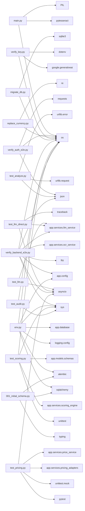

```mermaid
graph LR
    N0[main.py]
    N1[pytesseract]
    N0 --> N1
    N0[main.py]
    N2[PIL]
    N0 --> N2
    N0[main.py]
    N3[os]
    N0 --> N3
    N4[verify_auth_e2e.py]
    N5[requests]
    N4 --> N5
    N4[verify_auth_e2e.py]
    N6[json]
    N4 --> N6
    N4[verify_auth_e2e.py]
    N3[os]
    N4 --> N3
    N7[replace_currency.py]
    N3[os]
    N7 --> N3
    N7[replace_currency.py]
    N8[re]
    N7 --> N8
    N9[test_llm.py]
    N10[asyncio]
    N9 --> N10
    N9[test_llm.py]
    N11[app.services.llm_service]
    N9 --> N11
    N12[verify_key.py]
    N3[os]
    N12 --> N3
    N12[verify_key.py]
    N13[google.generativeai]
    N12 --> N13
    N12[verify_key.py]
    N14[dotenv]
    N12 --> N14
    N15[test_analyze.py]
    N16[urllib.request]
    N15 --> N16
    N15[test_analyze.py]
    N17[urllib.error]
    N15 --> N17
    N15[test_analyze.py]
    N6[json]
    N15 --> N6
    N18[test_llm_direct.py]
    N10[asyncio]
    N18 --> N10
    N18[test_llm_direct.py]
    N11[app.services.llm_service]
    N18 --> N11
    N18[test_llm_direct.py]
    N19[traceback]
    N18 --> N19
    N20[migrate_db.py]
    N21[sqlite3]
    N20 --> N21
    N20[migrate_db.py]
    N3[os]
    N20 --> N3
    N22[verify_backend_e2e.py]
    N3[os]
    N22 --> N3
    N22[verify_backend_e2e.py]
    N23[sys]
    N22 --> N23
    N22[verify_backend_e2e.py]
    N10[asyncio]
    N22 --> N10
    N22[verify_backend_e2e.py]
    N6[json]
    N22 --> N6
    N22[verify_backend_e2e.py]
    N24[fitz]
    N22 --> N24
    N22[verify_backend_e2e.py]
    N25[app.services.ocr_service]
    N22 --> N25
    N22[verify_backend_e2e.py]
    N11[app.services.llm_service]
    N22 --> N11
    N22[verify_backend_e2e.py]
    N26[app.config]
    N22 --> N26
    N27[env.py]
    N23[sys]
    N27 --> N23
    N27[env.py]
    N3[os]
    N27 --> N3
    N27[env.py]
    N28[logging.config]
    N27 --> N28
    N27[env.py]
    N29[sqlalchemy]
    N27 --> N29
    N27[env.py]
    N30[alembic]
    N27 --> N30
    N27[env.py]
    N26[app.config]
    N27 --> N26
    N27[env.py]
    N31[app.database]
    N27 --> N31
    N32[001_initial_schema.py]
    N33[typing]
    N32 --> N33
    N32[001_initial_schema.py]
    N30[alembic]
    N32 --> N30
    N32[001_initial_schema.py]
    N29[sqlalchemy]
    N32 --> N29
    N34[test_scoring.py]
    N23[sys]
    N34 --> N23
    N34[test_scoring.py]
    N3[os]
    N34 --> N3
    N34[test_scoring.py]
    N35[unittest]
    N34 --> N35
    N34[test_scoring.py]
    N36[app.services.scoring_engine]
    N34 --> N36
    N34[test_scoring.py]
    N37[app.models.schemas]
    N34 --> N37
    N38[test_pricing.py]
    N39[pytest]
    N38 --> N39
    N38[test_pricing.py]
    N10[asyncio]
    N38 --> N10
    N38[test_pricing.py]
    N40[unittest.mock]
    N38 --> N40
    N38[test_pricing.py]
    N41[app.services.pricing_adapters]
    N38 --> N41
    N38[test_pricing.py]
    N42[app.services.price_service]
    N38 --> N42
    N43[test_audit.py]
    N23[sys]
    N43 --> N23
    N43[test_audit.py]
    N3[os]
    N43 --> N3
    %% Graph truncated for readability
    click N0 href "./main.py" "View source file"
    click N4 href "./CarContractApp/verify_auth_e2e.py" "View source file"
    click N7 href "./CarContractApp/flutter_app/replace_currency.py" "View source file"
    click N9 href "./CarContractApp/backend/test_llm.py" "View source file"
    click N12 href "./CarContractApp/backend/verify_key.py" "View source file"
    click N15 href "./CarContractApp/backend/test_analyze.py" "View source file"
    click N18 href "./CarContractApp/backend/test_llm_direct.py" "View source file"
    click N20 href "./CarContractApp/backend/migrate_db.py" "View source file"
    click N22 href "./CarContractApp/backend/verify_backend_e2e.py" "View source file"
    click N27 href "./CarContractApp/backend/alembic/env.py" "View source file"
    click N32 href "./CarContractApp/backend/alembic/versions/001_initial_schema.py" "View source file"
    click N34 href "./CarContractApp/backend/tests/test_scoring.py" "View source file"
    click N38 href "./CarContractApp/backend/tests/test_pricing.py" "View source file"
    click N43 href "./CarContractApp/backend/tests/test_audit.py" "View source file"
```